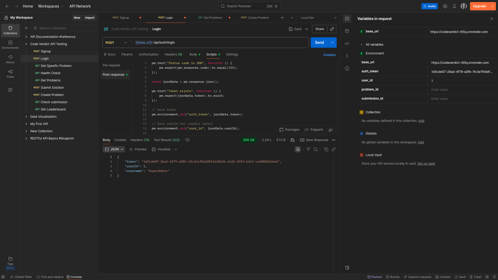
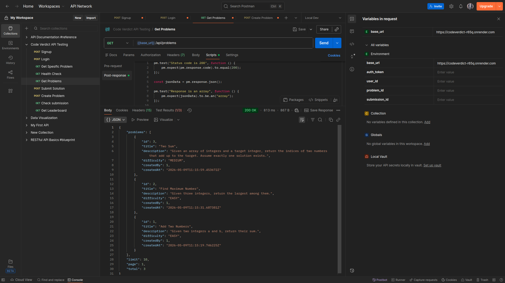
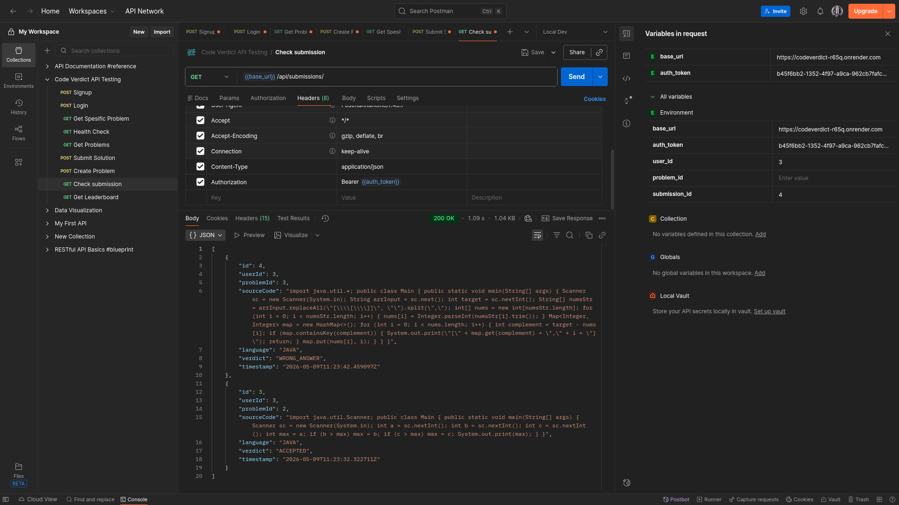
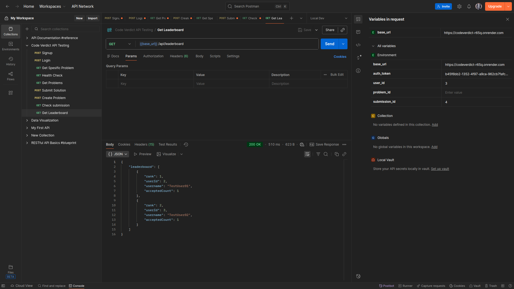

# CodeVerdict


**A highly-performant, secure, and asynchronous backend for evaluating user-submitted algorithms.**

CodeVerdict is a custom-built online judge system entirely decoupled from heavy web frameworks. It evaluates arbitrary Java code against hidden test cases in an isolated execution sandbox, utilizing a lightweight connection-pooling layer, robust JWT authentication, LRU service-caching, and an active queue system.

---

## 🚀 Features

- **Asynchronous Execution Queue**: Java submissions are compiled and judged concurrently via a bounded thread-pool (`ExecutorService`). 
- **Sandboxed Compilation**: Secure isolation evaluating source code using subprocesses (`ProcessBuilder`), with strict compile-time and execution-time bounds avoiding DoS/infinite loop abuse.
- **LRU In-Memory Caching**: Heavy leaderboard queries and problem listings are cached globally via a custom Thread-Safe `SimpleCache` (ReadWriteLock architecture).
- **Hardened Security**: Custom IP-based Rate Limiter mapped across `ConcurrentHashMap`, and robust bcrypt JWT Session tracking.
- **Dynamic Leaderboard**: Fast `GROUP BY` aggregations scoring user acceptance ratios asynchronously.
- **Zero-Dependency Core Routing**: Runs on standard `com.sun.net.httpserver`, minimizing bootstrap latency and container size.

---

## 🛠️ Tech Stack

- **Core**: Java 17
- **Routing & Networking**: `com.sun.net.httpserver.HttpServer`
- **Database**: PostgreSQL (JDBC) with custom Thread-Safe connection pooling
- **Security**: `BCrypt`, JWT-like custom token sessions
- **JSON Serialization**: `Gson`
- **Build & Management**: Maven (`pom.xml`)

---

## 📂 Architecture Overview

```text
src/main/java/com/codeverdict/
├── auth/         # BCrypt hashing, JWT generation, session validations
├── database/     # Abstracted DAOs, Schema DDL, and Connection Pools
├── handlers/     # Core REST API endpoints (Problems, Submissions, Leaderboards)
├── judge/        # The Execution Engine (Compilers, Sandboxes, Verdicts)
├── models/       # Database entities (User, Problem, TestCase, Submission)
├── server/       # HTTP Server Bootstrapper and Request Logging Filters
└── utils/        # LRU Caches, Env Configs, Rate Limiters, Exception Mappers
```

---

## 📦 Setup & Installation

**1. Clone the Repository**
```bash
git clone https://github.com/MylapalliYesebu/codeverdict.git
cd codeverdict
```

**2. Configure the Environment**
CodeVerdict dynamically loads an `.env` file from the root directory during startup.
```bash
cp .env.example .env
```
Fill out the variables inside `.env` with your local PostgreSQL database credentials.

**3. Build the Application**
Ensure you have Maven and Java 17+ installed.
```bash
mvn clean package -DskipTests
```
This generates a shaded uber-jar containing all core dependencies.

**4. Start the Server**
```bash
java -jar target/codeverdict.jar
```
*Note: The schema will automatically migrate and synchronize upon boot.*

---

## 🌍 API Endpoints

| Method | Endpoint               | Description                                   | Auth Required |
|--------|------------------------|-----------------------------------------------|---------------|
| `GET`  | `/api/health`          | Fetch live DB Pool & Judge Queue telemetry.   | ❌            |
| `POST` | `/api/auth/signup`     | Register a new account.                       | ❌            |
| `POST` | `/api/auth/login`      | Authenticate and receive a JWT token.         | ❌            |
| `POST` | `/api/auth/logout`     | Destroy current session token.                | ✅            |
| `GET`  | `/api/problems`        | Retrieve paginated problem listings.          | ❌            |
| `POST` | `/api/problems`        | Admin endpoint to create new questions.       | ✅ (ADMIN)    |
| `POST` | `/api/submit`          | Submit Java code for asynchronous execution.  | ✅            |
| `GET`  | `/api/submissions/:id` | Fetch the final verdict of a submission.      | ✅            |
| `GET`  | `/api/leaderboard`     | Fetch the globally aggregated leaderboard.    | ❌            |

---

## 🌐 Live Production URLs

The backend is currently deployed and accessible via Render, backed by a Neon PostgreSQL database.

| Endpoint | Production URL |
|----------|----------------|
| **Health** | `https://codeverdict-r65q.onrender.com/api/health` |
| **Signup** | `https://codeverdict-r65q.onrender.com/api/auth/signup` |
| **Login** | `https://codeverdict-r65q.onrender.com/api/auth/login` |
| **Problems** | `https://codeverdict-r65q.onrender.com/api/problems` |
| **Submit** | `https://codeverdict-r65q.onrender.com/api/submit` |
| **Leaderboard** | `https://codeverdict-r65q.onrender.com/api/leaderboard` |

---

## 💻 API Usage Examples (cURL)

Below are example `curl` commands demonstrating how to interact with the live production API.

**1. Register a New User**
```bash
curl -X POST https://codeverdict-r65q.onrender.com/api/auth/signup \
  -H "Content-Type: application/json" \
  -d '{"username":"coder123","email":"coder@example.com","password":"password123"}'
```

**2. Login to get a JWT Token**
```bash
curl -X POST https://codeverdict-r65q.onrender.com/api/auth/login \
  -H "Content-Type: application/json" \
  -d '{"email":"coder@example.com","password":"password123"}'
```
*Note: Extract the `"token"` value from the response for authenticated requests.*

**3. Fetch All Problems**
```bash
curl -X GET https://codeverdict-r65q.onrender.com/api/problems
```

**4. Submit a Solution**
*Requires an active session token.*
```bash
curl -X POST https://codeverdict-r65q.onrender.com/api/submit \
  -H "Authorization: Bearer YOUR_TOKEN_HERE" \
  -H "Content-Type: application/json" \
  -d '{
    "problemId": 1,
    "language": "java",
    "sourceCode": "import java.util.Scanner; public class Main { public static void main(String[] args) { Scanner sc = new Scanner(System.in); int a = sc.nextInt(); int b = sc.nextInt(); System.out.print(a + b); } }"
  }'
```

**5. Check Submission Status**
```bash
curl -X GET https://codeverdict-r65q.onrender.com/api/submissions/1 \
  -H "Authorization: Bearer YOUR_TOKEN_HERE"
```

**6. View the Leaderboard**
```bash
curl -X GET https://codeverdict-r65q.onrender.com/api/leaderboard
```

---


## 📸 Screenshots

### 1. User Login API


### 2. Get Problem API


### 3. Submissions API


### 4. Leaderboard API


---

## 🧪 Testing

CodeVerdict has 100% core business-logic coverage mapped across `JUnit 5`.
```bash
# Run the unit test suite
mvn clean test
```
To run the end-to-end API integration flow locally against a live database:
```bash
./test-api-workflow.sh
```

---

## ☁️ Deployment

CodeVerdict is fully infrastructure-as-code ready for [Render](https://render.com). 
A `render.yaml` configuration is located in the root repository mapping the Java environment bounds.

Just hook the repository to Render, configure your `.env` variables in the dashboard, and the pipeline will build automatically via `mvn clean package`.

---

## ⚠️ Known Limitations
- The Sandbox engine currently utilizes raw OS `ProcessBuilder` forks for isolated compilation, which is highly restricted but not a true Docker container.
- Currently supports evaluating only **Java (Java 17)** source code.

---

## 🔮 Future Improvements
- Migrate local subprocess sandboxing to a hardened Docker API execution layer.
- Add support for Python, C++, and JavaScript.
- Implement WebSocket streams for real-time submission verdicts.

---

## 🤝 Contribution Guide
Contributions, issues, and feature requests are always welcome!
1. Fork the Project
2. Create your Feature Branch (`git checkout -b feature/AmazingFeature`)
3. Commit your Changes (`git commit -m 'Add some AmazingFeature'`)
4. Push to the Branch (`git push origin feature/AmazingFeature`)
5. Open a Pull Request

---

## 📜 License
*Not Yet Licensed* - Please attach an appropriate Open-Source License (e.g. MIT, Apache 2.0) before distributing.